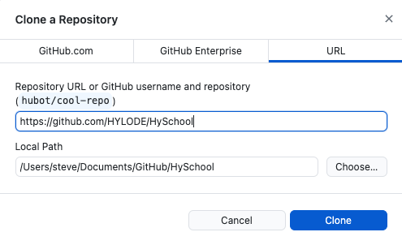

## Congratulations

I'm not sure how you got here, but whatever happened then '_Welcome_'.

We assume that you're here because you are going to start work with our data science team. This **readme.md** file will set-out some pre-requisites, and series of short lessons. Your first task will be to learn how to use GitHub for collaboration.

If you're trying explain to someone else how to get here then go to the [**'noobie'** branch](https://github.com/HYLODE/HySchool/tree/noobie) of the [HySchool repository](https://github.com/HYLODE/HySchool). 

## Aim

You are going to create your user own user page, and publish that to the HySchool website.

## Pre-requisites

- you should be working from your own computer
- you will need access to [GitHub](https://github.com) including a user account
- you will need the following applications.
    - a text editor. We recommend [Visual Studio Code](https://code.visualstudio.com) because it's free, cross-platform, well supported, and generally works well. But feel free to use any editor you like.
    - a 'git' graphical user application (GUI). You could try [GitHub desktop](https://desktop.github.com). You could also just use the integrated git tools within VS Code.
    - a terminal application (e.g. 'Terminal.app' on Mac OS).
- you should know how to write in 'Markdown'. See the background [here](https://commonmark.org), or review their [60 second(!) lesson](https://commonmark.org/help/), or run through the [10 minute interactive tutorial](https://commonmark.org/help/tutorial/).


If this is already all new to you then 

- check out Software Carpentry's tutorial [Unix Shell](https://swcarpentry.github.io/shell-novice/) (lessons 1-3 will get you started)
- similarly review their tutorial on [Version Control with Git](https://swcarpentry.github.io/git-novice/). You will need to run through lessons 1-3 but the 'juice' starts from Lesson 4.


## Lesson plan

1. Set-up `<-- you are here`
2. Install Quarto (our documentation and website system)
3. Write and publish your first page

Please note that this **readme.md** file will change as we progress through the lessons. You will need to come back here after each step.

# Lesson 1

Given the pre-requisites above then you need to clone this repository to your local machine. We're going to assume you're using GitHub desktop where you will need to select the **File > Clone Repository...** menu, and then the **URL** tab of the dialog box. Paste the URL of the repository (https://github.com/HYLODE/HySchool) into the first text field, and then choose a local path (on your machine) to store your work.  



You will need to *switch branches* after you clone the repository to this one (the 'noobie' branch).

# Next ...

You are ready to checkout the next lesson.

You can do this from the command line.

```sh
git checkout noobie-lesson-2
```

To get back here, then you will need to do

```sh
git checkout noobie-lesson-1
```

You can also search for the **noobie-lesson-1** tag in the git history.

